# 🏋️ FitTrack

A modern Flutter Fitness Tracker app with Firebase Authentication, SQLite, BMI Calculator, Goals, Workout Analytics, Dark Mode, and Beautiful Material UI.
---

## 📱 Features

- 🔐 Firebase Authentication
- 👤 User Profile with Profile Picture
- 💪 Add, Edit & Delete Workouts
- 📊 Workout Summary Dashboard
- 📈 Weekly Progress Analytics
- 📉 Workout Chart
- 🎯 Fitness Goals
- ⚖️ BMI Calculator
- 🔍 Workout Search
- 🔄 Pull to Refresh
- 🌙 Dark Mode Support
- 👋 Personalized Greeting
- 💬 Daily Motivation Quotes
- 📱 Responsive UI
- 🎨 Modern Material Design
- 🚀 Beautiful Splash Screen
- 📊 Interactive Dashboard
- 🔥 Daily Workout Tracking

---

## 🛠 Tech Stack

- Flutter
- Dart
- Firebase Authentication
- SQLite (sqflite)
- Shared Preferences
- Provider
- Material Design 3
---

## 📂 Project Structure

```
lib/
│
├── models/
├── screens/
├── services/
├── widgets/
├── app.dart
└── main.dart
```

---

## 🚀 Getting Started

### Clone Repository

```bash
git clone https://github.com/harshitZ1/CodeAlpha_FitTrack.git
```

### Install Dependencies

```bash
flutter pub get
```

### Run App

```bash
flutter run
```

---

# 📸 App Screenshots

| Splash | Login |
|--------|-------|
| 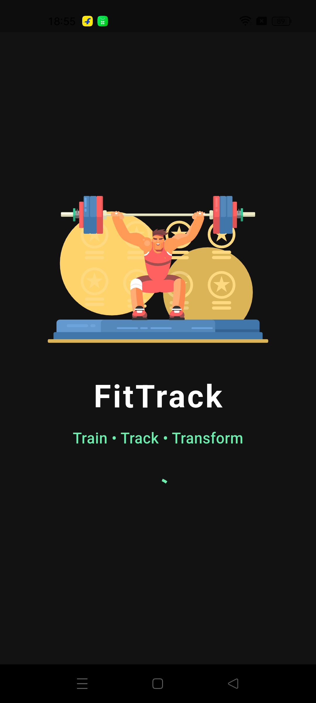 | 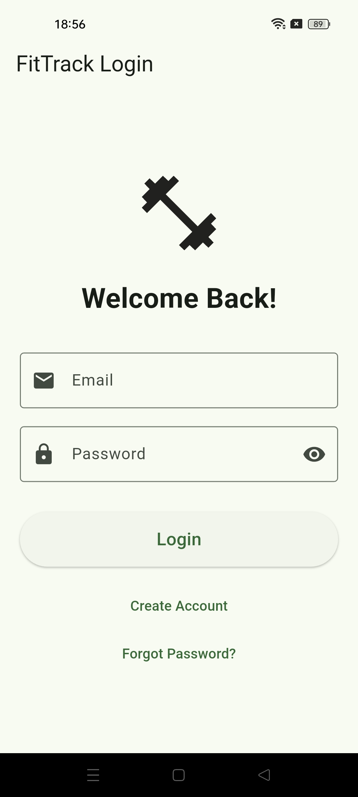 |

| Home | Add Workout |
|------|-------------|
| 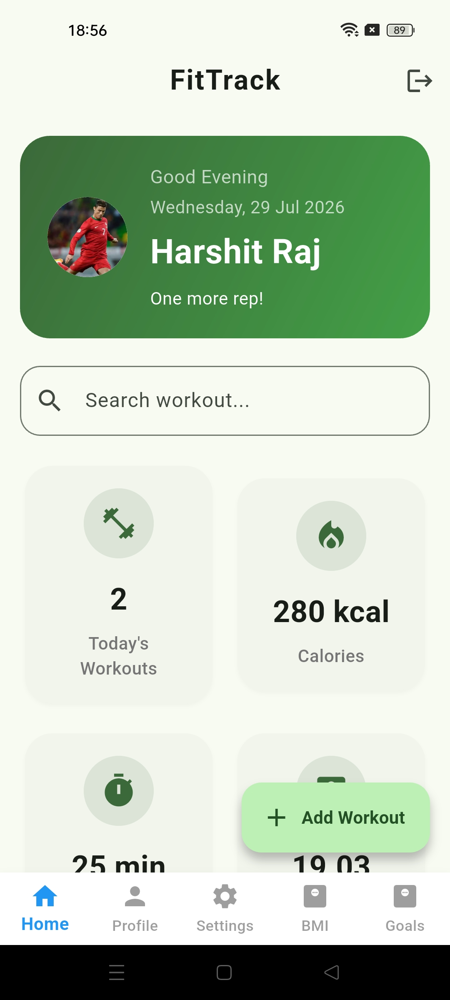 | 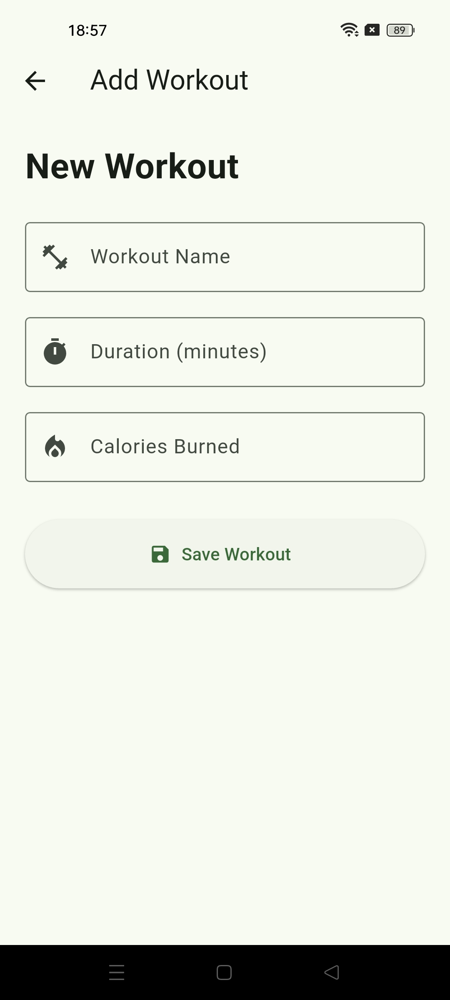 |

| Workout History | Charts |
|-----------------|--------|
| 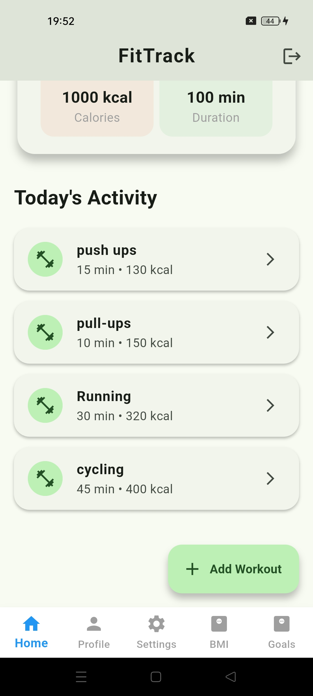 | 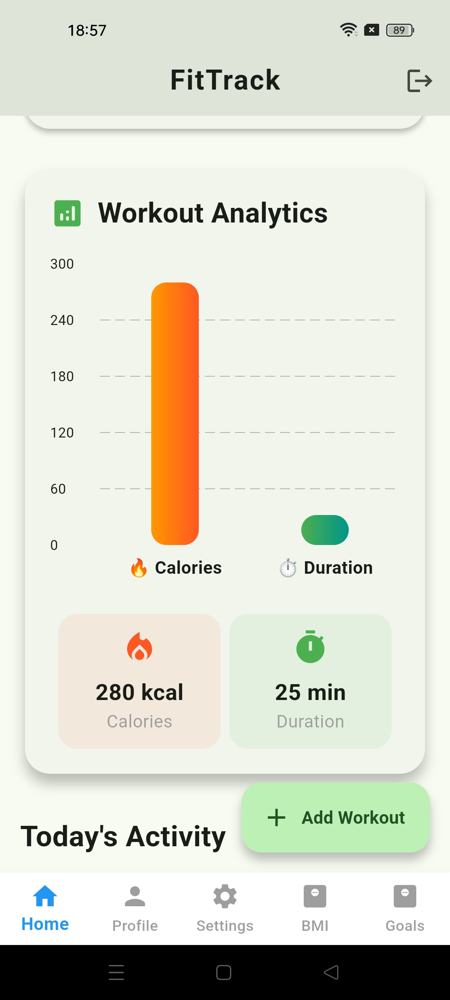 |

| Goals | BMI |
|-------|-----|
| 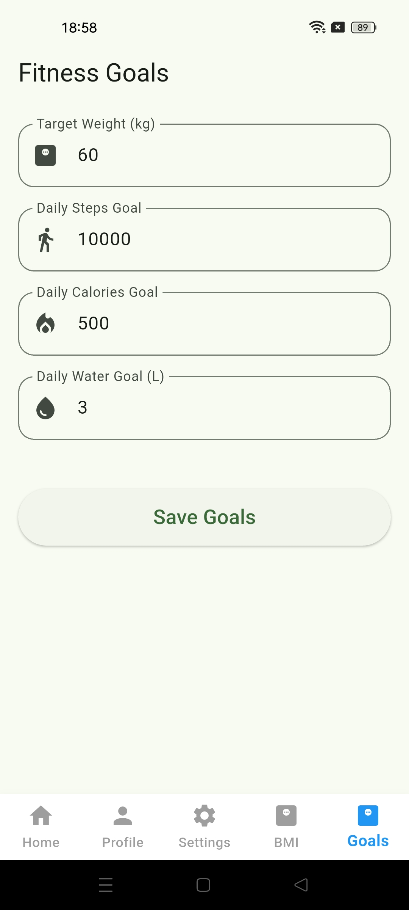 | 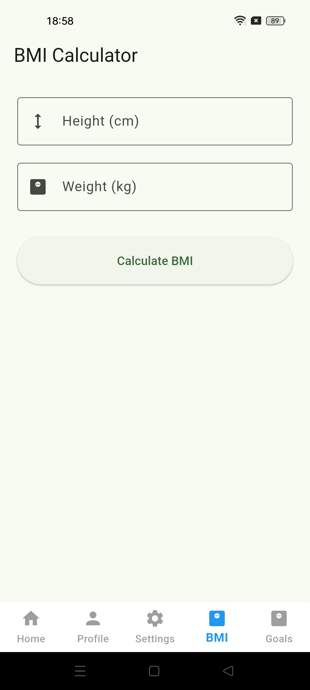 |

| Profile | Dark Mode |
|---------|-----------|
| 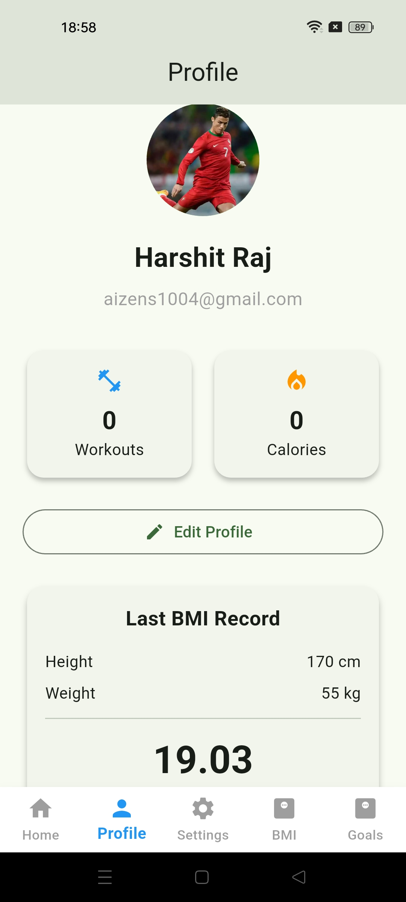 | 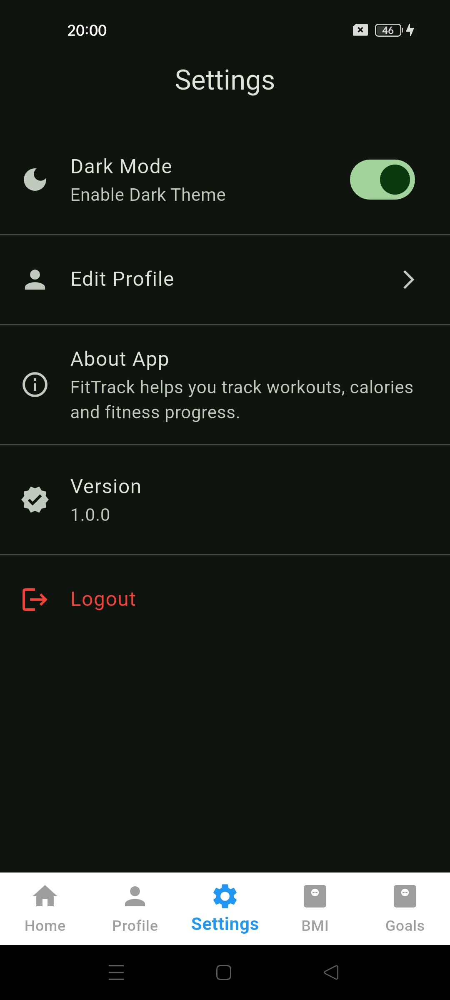 |

| Settings |
|----------|
| 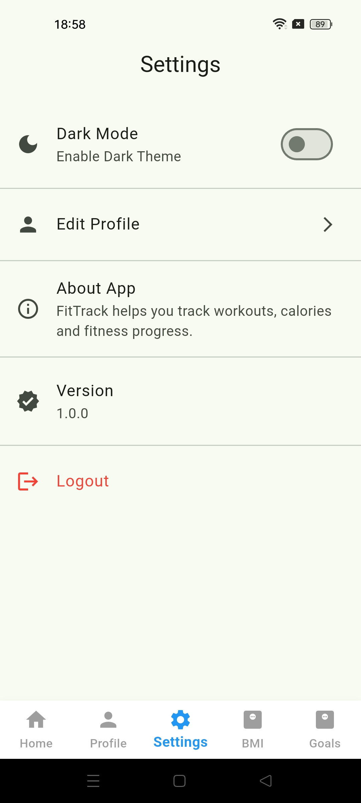 |

--- 

## ✨ Highlights

- Clean Architecture
- Reusable Widgets
- Responsive Design
- Local Database Support
- Firebase Authentication
- Modern UI
- Easy to Maintain Code

---

## 🔮 Future Improvements

- Step Counter
- Water Intake Tracker
- Sleep Tracker
- Cloud Backup
- AI Workout Suggestions
- PDF Export
- Notifications
- Data Backup

---

## 👨‍💻 Developed By

**Harshit Raj**

B.Tech CSE (AI & ML)

Flutter Developer

---

## 📄 License

This project is licensed under the MIT License.
